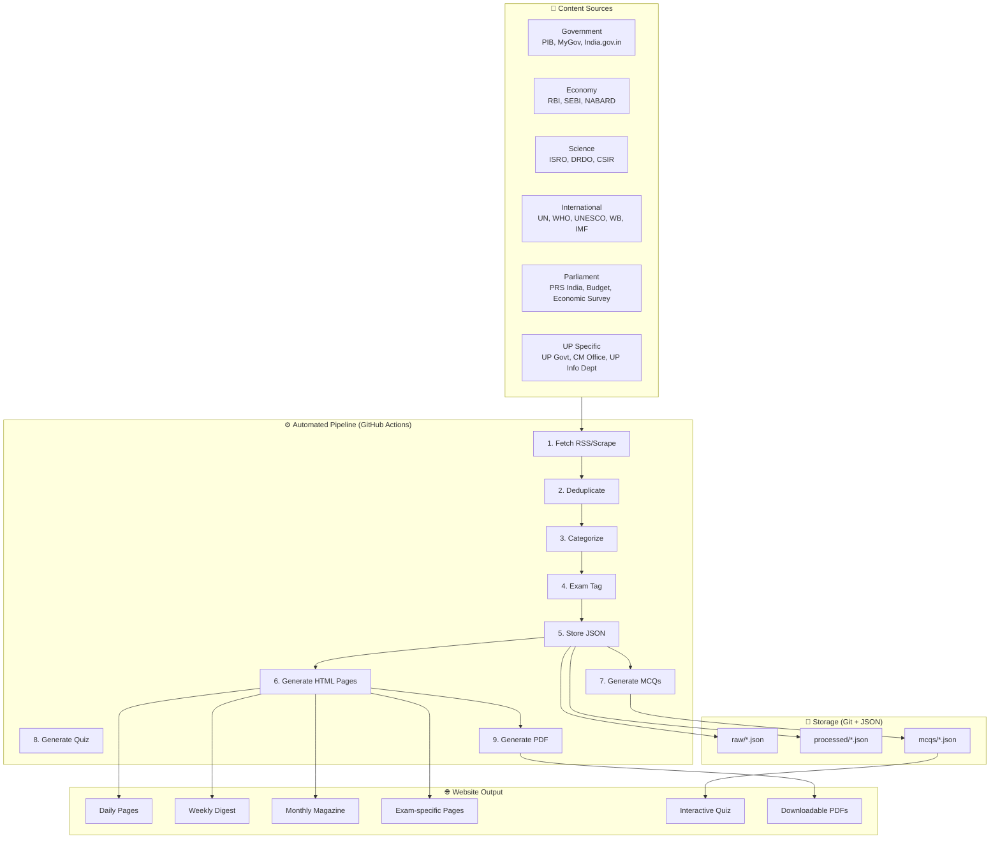
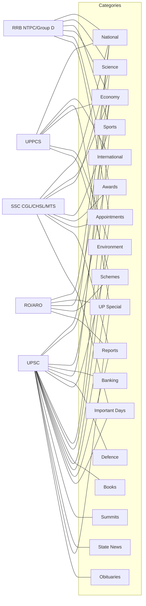
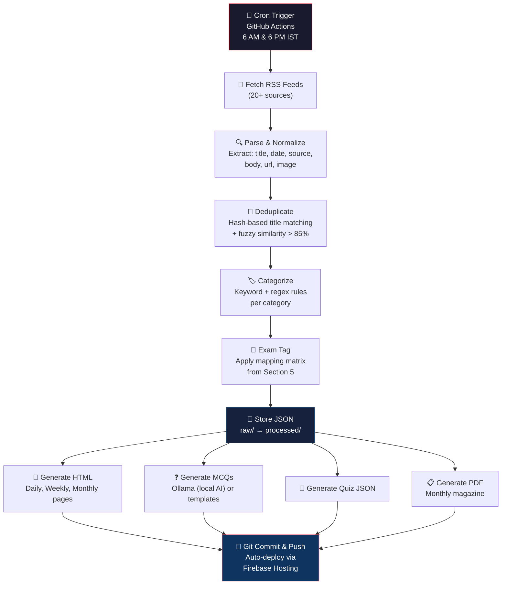
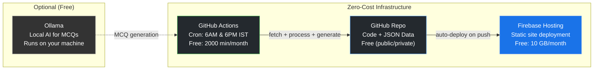

# SJMaths Current Affairs System — Zero-Cost Architecture

> [!NOTE]
> This document is the **complete technical specification** for building an automated current affairs platform integrated into the existing [sjmaths-website](file:///c:/Users/sande/Documents/GitHub/sjmaths-website). It covers architecture, data flow, content sources, exam mapping, MCQ generation, SEO strategy, infrastructure, and a phased implementation roadmap.

---

## 1. Objective

Build a **fully automated, zero-cost** current affairs platform serving **8 competitive exams**:

| Exam | Level | Primary Focus |
|------|-------|---------------|
| **SSC CGL** | National | General Awareness, Economy, Science |
| **SSC CHSL** | National | General Awareness (easier tier) |
| **SSC MTS** | National | Basic Current Affairs |
| **RRB NTPC** | National | General Awareness, Science |
| **RRB Group D** | National | General Science, Current Events |
| **RO/ARO** | State (UP) | UP Special, Government Schemes |
| **UPPCS** | State (UP) | UP + National + International |
| **UPSC** | National | All categories (comprehensive) |

### Deliverables Generated Automatically

- ✅ **Daily Current Affairs** — published every day
- ✅ **Exam-wise Current Affairs** — filtered per exam syllabus
- ✅ **Daily MCQs** — 10–20 questions per day with explanations
- ✅ **Weekly Revision Notes** — consolidated weekly digest
- ✅ **Monthly Current Affairs Magazine** — downloadable PDF
- ✅ **Current Affairs Quiz** — interactive timed quizzes

---

## 2. System Architecture Overview



---

## 3. Content Sources — RSS Feeds & APIs

### 3.1 Official Government Sources

| Source | URL | Feed Type | Update Frequency |
|--------|-----|-----------|-----------------|
| **PIB (Press Information Bureau)** | `https://pib.gov.in/RssMain.aspx` | RSS | Multiple daily |
| **MyGov India** | `https://www.mygov.in/rss.xml` | RSS | Daily |
| **India.gov.in** | `https://www.india.gov.in/rss/all` | RSS | Daily |
| **NITI Aayog** | `https://niti.gov.in/rss.xml` | RSS/Scrape | Weekly |

### 3.2 Economy & Banking

| Source | URL | Feed Type | Update Frequency |
|--------|-----|-----------|-----------------|
| **RBI** | `https://rbi.org.in/scripts/RSSFeed.aspx` | RSS | Daily |
| **SEBI** | `https://www.sebi.gov.in/sebiweb/home/RSS.jsp` | RSS | Weekly |
| **NABARD** | `https://www.nabard.org` | Scrape | Weekly |
| **Ministry of Finance** | `https://pib.gov.in/rss/MinistryRSS.aspx?MinID=6` | RSS | Daily |

### 3.3 Science & Technology

| Source | URL | Feed Type | Update Frequency |
|--------|-----|-----------|-----------------|
| **ISRO** | `https://www.isro.gov.in/rss.xml` | RSS | Weekly |
| **DRDO** | `https://www.drdo.gov.in` | Scrape | Fortnightly |
| **CSIR** | `https://www.csir.res.in` | Scrape | Weekly |

### 3.4 International Organizations

| Source | URL | Feed Type | Update Frequency |
|--------|-----|-----------|-----------------|
| **United Nations** | `https://news.un.org/feed/subscribe/en/news/all/rss.xml` | RSS | Multiple daily |
| **WHO** | `https://www.who.int/feeds/entity/mediacentre/news/en/rss.xml` | RSS | Daily |
| **UNESCO** | `https://en.unesco.org/rss.xml` | RSS | Weekly |
| **World Bank** | `https://www.worldbank.org/en/news/rss.xml` | RSS | Weekly |
| **IMF** | `https://www.imf.org/en/News/rss` | RSS | Weekly |

### 3.5 Parliament & Reports

| Source | URL | Feed Type | Update Frequency |
|--------|-----|-----------|-----------------|
| **PRS India** | `https://prsindia.org/rss.xml` | RSS | Daily (session) |
| **Economic Survey** | Manual / PIB | Annual | Annual |
| **Union Budget** | Manual / PIB | Annual | Annual |

### 3.6 Uttar Pradesh Specific

| Source | URL | Feed Type | Update Frequency |
|--------|-----|-----------|-----------------|
| **UP Government** | `https://up.gov.in` | Scrape | Daily |
| **UP Information Dept** | `https://information.up.gov.in` | Scrape | Daily |
| **UP Finance Dept** | `https://finance.up.nic.in` | Scrape | Weekly |
| **CM Office UP** | `https://cm.up.gov.in` | Scrape | Daily |

> [!TIP]
> RSS feeds are preferred for reliability. For sources without RSS, a lightweight scraper with CSS selectors should be used. All scrapers must include `User-Agent` headers and respect `robots.txt`.

---

## 4. Content Categories

The system classifies every news item into one or more of **18 categories**:

| # | Category | Code | Description |
|---|----------|------|-------------|
| 1 | National Affairs | `national` | Domestic policy, governance, law |
| 2 | International Affairs | `international` | Foreign policy, global events |
| 3 | Economy | `economy` | GDP, fiscal policy, trade |
| 4 | Banking | `banking` | RBI policy, bank regulations |
| 5 | Science & Technology | `science` | Space, biotech, digital India |
| 6 | Defence | `defence` | Military, exercises, acquisitions |
| 7 | Environment | `environment` | Climate, biodiversity, pollution |
| 8 | Sports | `sports` | Tournaments, records, awards |
| 9 | Awards | `awards` | National/international awards |
| 10 | Books & Authors | `books` | Notable publications |
| 11 | Appointments | `appointments` | Key designations, resignations |
| 12 | Government Schemes | `schemes` | Yojana, programs, welfare |
| 13 | Reports & Indexes | `reports` | Global indices, survey reports |
| 14 | Important Days | `days` | National/international days |
| 15 | Summits & Conferences | `summits` | G20, BRICS, COP, bilateral |
| 16 | State News | `state` | State-level developments |
| 17 | UP Special | `up_special` | Uttar Pradesh specific news |
| 18 | Obituaries | `obituaries` | Notable deaths |

---

## 5. Exam-to-Category Mapping

Each exam subscribes to a subset of the 18 categories. This mapping drives the exam-specific page generation.



### Detailed Mapping Table

| Category | SSC CGL | SSC CHSL | SSC MTS | RRB NTPC | RRB Grp D | RO/ARO | UPPCS | UPSC |
|----------|---------|----------|---------|----------|-----------|--------|-------|------|
| National | ✅ | ✅ | ✅ | ✅ | ✅ | ✅ | ✅ | ✅ |
| International | — | — | — | — | — | — | ✅ | ✅ |
| Economy | ✅ | ✅ | — | ✅ | — | ✅ | ✅ | ✅ |
| Banking | — | — | — | — | — | — | — | ✅ |
| Science | ✅ | ✅ | ✅ | ✅ | ✅ | — | — | ✅ |
| Defence | — | — | — | — | — | — | — | ✅ |
| Environment | — | — | — | — | — | — | ✅ | ✅ |
| Sports | ✅ | ✅ | ✅ | ✅ | ✅ | — | — | ✅ |
| Awards | ✅ | ✅ | ✅ | ✅ | ✅ | — | — | ✅ |
| Books & Authors | — | — | — | — | — | — | — | ✅ |
| Appointments | ✅ | ✅ | — | ✅ | — | — | — | ✅ |
| Govt Schemes | — | — | — | — | — | ✅ | ✅ | ✅ |
| Reports & Indexes | ✅ | — | — | — | — | ✅ | — | ✅ |
| Important Days | ✅ | ✅ | ✅ | — | — | — | — | ✅ |
| Summits | — | — | — | — | — | — | — | ✅ |
| State News | — | — | — | — | — | — | — | ✅ |
| UP Special | — | — | — | — | — | ✅ | ✅ | ✅ |
| Obituaries | — | — | — | — | — | — | — | ✅ |

> [!IMPORTANT]
> **UPSC gets ALL categories** — it is the most comprehensive exam. SSC and Railway focus on factual recall (awards, sports, appointments, days). RO/ARO and UPPCS emphasize UP-specific and governance content.

---

## 6. Data Flow Pipeline



### 6.1 Step-by-Step Pipeline Detail

#### Step 1 — Fetch (`scripts/current-affairs/fetch-rss.js`)
```
Input:  RSS feed URLs from config/rss-sources.json
Output: data/raw/YYYY-MM-DD.json
Logic:  
  - Fetch each RSS feed with timeout (10s)
  - Parse XML → JSON
  - Extract: title, link, pubDate, description, source
  - Normalize dates to IST
  - Save raw JSON with fetch timestamp
```

#### Step 2 — Deduplicate (`scripts/current-affairs/deduplicate.js`)
```
Input:  data/raw/YYYY-MM-DD.json
Output: data/raw/YYYY-MM-DD-deduped.json
Logic:
  - Hash each title (lowercase, stripped)
  - Compare against last 7 days' hash sets
  - Fuzzy match threshold: 85% similarity
  - Keep first occurrence, mark duplicates
```

#### Step 3 — Categorize (`scripts/current-affairs/categorize.js`)
```
Input:  Deduped JSON
Output: data/processed/YYYY-MM-DD.json
Logic:
  - Keyword dictionaries per category
  - Source-based hints (e.g., ISRO → Science)
  - Multi-category assignment allowed
  - Fallback: "national" if no match
```

#### Step 4 — Exam Tag (`scripts/current-affairs/exam-tag.js`)
```
Input:  Categorized JSON
Output: data/processed/YYYY-MM-DD.json (updated)
Logic:
  - Apply mapping matrix from Section 5
  - Each item gets array of exam tags
  - e.g., ["ssc-cgl", "ssc-chsl", "rrb-ntpc", "upsc"]
```

#### Step 5 — Generate Pages (`scripts/current-affairs/generate-pages.js`)
```
Input:  data/processed/YYYY-MM-DD.json
Output: current-affairs/daily/YYYY-MM-DD/index.html
        current-affairs/ssc-cgl/index.html (updated)
        current-affairs/railway/index.html (updated)
        ... etc.
Logic:
  - Use HTML template with sjmaths design system
  - Filter items by exam tags for exam pages
  - Aggregate weekly/monthly from daily data
  - Generate proper breadcrumbs and navigation
```

#### Step 6 — Generate MCQs (`scripts/current-affairs/generate-mcqs.js`)
```
Input:  data/processed/YYYY-MM-DD.json
Output: current-affairs/mcqs/YYYY-MM-DD.json
        current-affairs/mcq/index.html
Logic:
  - For each "important" news item (priority > threshold)
  - Generate MCQ using template or Ollama
  - Include: question, 4 options, answer, explanation, exam tags, difficulty
  - Validate: no duplicate questions, correct answer in options
```

---

## 7. JSON Data Schema

### 7.1 Raw News Item

```json
{
  "id": "pib-2026-06-01-001",
  "title": "India launches Gaganyaan crew module test",
  "source": "PIB",
  "sourceUrl": "https://pib.gov.in/...",
  "pubDate": "2026-06-01T10:30:00+05:30",
  "fetchDate": "2026-06-01T12:00:00+05:30",
  "description": "ISRO successfully conducted the crew escape system test...",
  "imageUrl": "https://pib.gov.in/images/...",
  "hash": "a1b2c3d4e5f6"
}
```

### 7.2 Processed News Item

```json
{
  "id": "pib-2026-06-01-001",
  "title": "India launches Gaganyaan crew module test",
  "source": "PIB",
  "sourceUrl": "https://pib.gov.in/...",
  "pubDate": "2026-06-01T10:30:00+05:30",
  "description": "ISRO successfully conducted the crew escape system test...",
  "categories": ["science", "national"],
  "examTags": ["ssc-cgl", "ssc-chsl", "ssc-mts", "rrb-ntpc", "rrb-group-d", "upsc"],
  "importance": "high",
  "keywords": ["ISRO", "Gaganyaan", "space", "crew module"],
  "imageUrl": "https://pib.gov.in/images/..."
}
```

### 7.3 MCQ Item

```json
{
  "id": "mcq-2026-06-01-001",
  "newsId": "pib-2026-06-01-001",
  "question": "Which organization successfully conducted the Gaganyaan crew module test in June 2026?",
  "options": [
    "DRDO",
    "ISRO",
    "HAL",
    "CSIR"
  ],
  "correctAnswer": 1,
  "explanation": "ISRO (Indian Space Research Organisation) conducted the Gaganyaan crew escape system test as part of India's human spaceflight program.",
  "category": "science",
  "examTags": ["ssc-cgl", "rrb-ntpc", "upsc"],
  "difficulty": "easy",
  "date": "2026-06-01"
}
```

### 7.4 Quiz Configuration

```json
{
  "quizId": "daily-2026-06-01",
  "title": "Daily Current Affairs Quiz — June 1, 2026",
  "date": "2026-06-01",
  "timeLimit": 600,
  "questions": ["mcq-2026-06-01-001", "mcq-2026-06-01-002"],
  "totalQuestions": 10,
  "passingScore": 7,
  "examFilter": null
}
```

---

## 8. MCQ Generation System

### 8.1 Generation Methods

| Method | Cost | Quality | Speed |
|--------|------|---------|-------|
| **Template-based** | Free | Good (formulaic) | Instant |
| **Ollama (local AI)** | Free | Excellent | ~5s per MCQ |
| **Manual curation** | Free (time) | Best | Slow |

### 8.2 Template-based MCQ Patterns

```
Pattern 1 — "Who/Which" Questions
  "Which {entity_type} {action_verb} {event}?"

Pattern 2 — "When" Questions
  "When was {event} {action}?"

Pattern 3 — "Where" Questions
  "Where was the {event_name} held in {year}?"

Pattern 4 — Fact-based
  "{entity} is related to which of the following?"
  
Pattern 5 — One-liner
  "Consider the following statements:
   1. ...
   2. ...
   Which of the above is/are correct?"
```

### 8.3 Difficulty Levels

| Level | Target Exams | Characteristics |
|-------|-------------|-----------------|
| **Easy** | SSC MTS, RRB Group D | Direct factual recall, single concept |
| **Moderate** | SSC CGL, SSC CHSL, RRB NTPC, RO/ARO | Requires understanding context |
| **Advanced** | UPPCS, UPSC | Multi-concept, analytical, statement-based |

### 8.4 Ollama Integration (Optional)

```
Model: llama3.2 or mistral (runs locally)
Prompt Template:
  "Generate an MCQ for competitive exam preparation based on:
   News: {title}
   Details: {description}
   Category: {category}
   Difficulty: {difficulty}
   
   Return JSON with: question, options (4), correctAnswer (0-3), explanation"

Usage:
  - Run on local machine or self-hosted
  - Batch process at end of day
  - Validate output before publishing
  - No API costs ever
```

---

## 9. Folder Structure

Aligned with the existing [sjmaths-website](file:///c:/Users/sande/Documents/GitHub/sjmaths-website) repository structure:

```
sjmaths-website/
├── current-affairs/                    # ← NEW top-level directory
│   ├── index.html                     # Current affairs landing page
│   │
│   ├── data/                          # JSON data store (git-tracked)
│   │   ├── raw/                       # Raw fetched data
│   │   │   └── 2026-06-01.json
│   │   ├── processed/                 # Categorized & tagged data
│   │   │   └── 2026-06-01.json
│   │   └── mcqs/                      # Generated MCQs
│   │       └── 2026-06-01.json
│   │
│   ├── daily/                         # Daily current affairs pages
│   │   ├── index.html                 # Daily archive/listing
│   │   ├── 2026-06-01/
│   │   │   └── index.html
│   │   └── 2026-06-02/
│   │       └── index.html
│   │
│   ├── weekly/                        # Weekly digests
│   │   ├── index.html
│   │   └── 2026-w22/
│   │       └── index.html
│   │
│   ├── monthly/                       # Monthly magazines
│   │   ├── index.html
│   │   └── 2026-06/
│   │       └── index.html
│   │
│   ├── ssc-cgl/                       # SSC CGL filtered view
│   │   └── index.html
│   ├── ssc-chsl/
│   │   └── index.html
│   ├── ssc-mts/
│   │   └── index.html
│   ├── railway/                       # RRB NTPC + Group D
│   │   └── index.html
│   ├── roaro/                         # RO/ARO filtered view
│   │   └── index.html
│   ├── uppcs/                         # UPPCS filtered view
│   │   └── index.html
│   ├── upsc/                          # UPSC filtered view
│   │   └── index.html
│   │
│   ├── mcq/                           # MCQ practice pages
│   │   ├── index.html
│   │   └── 2026-06-01.html
│   │
│   ├── quiz/                          # Interactive quiz
│   │   └── index.html
│   │
│   └── pdf/                           # Downloadable PDFs
│       ├── index.html
│       └── monthly-june-2026.pdf
│
├── scripts/                           # Existing scripts directory
│   ├── current-affairs/               # ← NEW automation scripts
│   │   ├── fetch-rss.js
│   │   ├── deduplicate.js
│   │   ├── categorize.js
│   │   ├── exam-tag.js
│   │   ├── generate-pages.js
│   │   ├── generate-mcqs.js
│   │   ├── generate-quiz.js
│   │   ├── generate-pdf.js
│   │   └── config/
│   │       ├── rss-sources.json
│   │       ├── category-keywords.json
│   │       └── exam-mapping.json
│   └── ... (existing scripts)
│
└── .github/
    └── workflows/
        └── current-affairs.yml        # ← NEW GitHub Actions workflow
```

> [!WARNING]
> The `current-affairs/data/` directory will grow over time. Consider adding a script to archive data older than 6 months into compressed yearly files to keep the repo manageable.

---

## 10. Generated Website Pages — URL Structure

### 10.1 Page Routes

| Page Type | URL Pattern | Example |
|-----------|------------|---------|
| **Landing** | `/current-affairs/` | `/current-affairs/` |
| **Daily** | `/current-affairs/daily/YYYY-MM-DD/` | `/current-affairs/daily/2026-06-01/` |
| **Daily Archive** | `/current-affairs/daily/` | `/current-affairs/daily/` |
| **Weekly** | `/current-affairs/weekly/YYYY-wWW/` | `/current-affairs/weekly/2026-w22/` |
| **Weekly Archive** | `/current-affairs/weekly/` | `/current-affairs/weekly/` |
| **Monthly** | `/current-affairs/monthly/YYYY-MM/` | `/current-affairs/monthly/2026-06/` |
| **Monthly Archive** | `/current-affairs/monthly/` | `/current-affairs/monthly/` |
| **SSC CGL** | `/current-affairs/ssc-cgl/` | `/current-affairs/ssc-cgl/` |
| **SSC CHSL** | `/current-affairs/ssc-chsl/` | `/current-affairs/ssc-chsl/` |
| **SSC MTS** | `/current-affairs/ssc-mts/` | `/current-affairs/ssc-mts/` |
| **Railway** | `/current-affairs/railway/` | `/current-affairs/railway/` |
| **RO/ARO** | `/current-affairs/roaro/` | `/current-affairs/roaro/` |
| **UPPCS** | `/current-affairs/uppcs/` | `/current-affairs/uppcs/` |
| **UPSC** | `/current-affairs/upsc/` | `/current-affairs/upsc/` |
| **MCQs** | `/current-affairs/mcq/` | `/current-affairs/mcq/` |
| **Quiz** | `/current-affairs/quiz/` | `/current-affairs/quiz/` |
| **PDFs** | `/current-affairs/pdf/` | `/current-affairs/pdf/` |

### 10.2 Integration with Existing Site

The current affairs section should be linked from:
- The main [index.html](file:///c:/Users/sande/Documents/GitHub/sjmaths-website/index.html) navigation
- The [sidebar.html](file:///c:/Users/sande/Documents/GitHub/sjmaths-website/components/sidebar.html) component
- The SSC CGL section at [ssc-cgl/](file:///c:/Users/sande/Documents/GitHub/sjmaths-website/ssc-cgl) (cross-link to `/current-affairs/ssc-cgl/`)
- The UPSC section at [upsc/](file:///c:/Users/sande/Documents/GitHub/sjmaths-website/upsc) (cross-link to `/current-affairs/upsc/`)

---

## 11. Search & Filter System

The current affairs pages must support client-side filtering:

### 11.1 Filter Dimensions

| Filter | Type | Values |
|--------|------|--------|
| **Date** | Date picker | Any date |
| **Category** | Multi-select dropdown | 18 categories |
| **Exam** | Dropdown | 8 exams |
| **Month** | Dropdown | Jan–Dec |
| **Year** | Dropdown | 2026+ |
| **Keyword** | Text search | Free text |

### 11.2 Implementation

```
Approach: Client-side JavaScript filtering on JSON data
Data:     Load current-affairs/data/processed/*.json via fetch()
UI:       Filter bar at top of each current affairs page
Search:   Full-text search on title + description + keywords
URL:      Update URL params for shareable filtered views
           e.g., /current-affairs/daily/?category=science&exam=ssc-cgl
```

---

## 12. SEO Strategy

### 12.1 Target Keywords (Long-tail)

The URL structure is specifically designed to target high-search-volume keywords:

| Target Keyword | Monthly Search Volume (est.) | URL |
|---------------|------------------------------|-----|
| SSC CGL current affairs | 40,000+ | `/current-affairs/ssc-cgl/` |
| Railway current affairs | 30,000+ | `/current-affairs/railway/` |
| UPSC current affairs | 50,000+ | `/current-affairs/upsc/` |
| UPPCS current affairs | 15,000+ | `/current-affairs/uppcs/` |
| RO ARO current affairs | 10,000+ | `/current-affairs/roaro/` |
| Daily current affairs | 100,000+ | `/current-affairs/daily/` |
| Weekly current affairs | 20,000+ | `/current-affairs/weekly/` |
| Monthly current affairs PDF | 35,000+ | `/current-affairs/pdf/` |
| Current affairs MCQ | 25,000+ | `/current-affairs/mcq/` |
| Current affairs quiz | 15,000+ | `/current-affairs/quiz/` |

### 12.2 Page-level SEO

Each generated page must include:

```html
<!-- Title -->
<title>SSC CGL Current Affairs June 2026 — SJMaths</title>

<!-- Meta Description -->
<meta name="description" content="Latest SSC CGL current affairs for June 2026. 
  Daily updated national, economy, science & sports news with MCQs for SSC CGL exam preparation.">

<!-- Canonical -->
<link rel="canonical" href="https://sjmaths.com/current-affairs/ssc-cgl/">

<!-- Open Graph -->
<meta property="og:title" content="SSC CGL Current Affairs June 2026">
<meta property="og:description" content="...">
<meta property="og:type" content="article">
<meta property="og:url" content="https://sjmaths.com/current-affairs/ssc-cgl/">

<!-- Structured Data (JSON-LD) -->
<script type="application/ld+json">
{
  "@context": "https://schema.org",
  "@type": "Article",
  "headline": "SSC CGL Current Affairs June 2026",
  "datePublished": "2026-06-01",
  "dateModified": "2026-06-01",
  "publisher": { "@type": "Organization", "name": "SJMaths" }
}
</script>
```

### 12.3 Sitemap Integration

Add current affairs URLs to the existing [sitemap.xml](file:///c:/Users/sande/Documents/GitHub/sjmaths-website/sitemap.xml) structure:
- Add a new `sitemap-current-affairs.xml` to the sitemap index
- Include all daily, weekly, monthly, and exam-specific URLs
- Update the [generate-sitemaps.js](file:///c:/Users/sande/Documents/GitHub/sjmaths-website/generate-sitemaps.js) script

### 12.4 Searchable Archive

Over time, this structure creates a **massive keyword-rich archive**:

```
After 1 year:
  365 daily pages
  52  weekly pages
  12  monthly pages
  8   exam pages (continuously updated)
  365 MCQ pages
  = ~800+ indexed pages with unique content
```

---

## 13. Infrastructure — Zero-Cost Stack

### 13.1 Architecture



### 13.2 Cost Breakdown

| Service | Free Tier | Our Usage (est.) | Cost |
|---------|-----------|-------------------|------|
| **GitHub** | Unlimited repos, 2000 Actions min/month | ~500 min/month | **$0** |
| **Firebase Hosting** | 10 GB storage, 360 MB/day transfer | ~2 GB storage | **$0** |
| **Ollama** | Open-source, runs locally | As needed | **$0** |
| **Domain** | Already owned (sjmaths.com) | — | **$0** |
| **Total** | — | — | **$0/month** |

### 13.3 GitHub Actions Workflow

```yaml
# .github/workflows/current-affairs.yml
name: Current Affairs Pipeline

on:
  schedule:
    # Run at 6 AM IST (00:30 UTC) and 6 PM IST (12:30 UTC)
    - cron: '30 0 * * *'
    - cron: '30 12 * * *'
  workflow_dispatch:  # Manual trigger

jobs:
  update-current-affairs:
    runs-on: ubuntu-latest
    steps:
      - uses: actions/checkout@v4
      
      - uses: actions/setup-node@v4
        with:
          node-version: '20'
      
      - name: Install dependencies
        run: npm ci
      
      - name: Fetch RSS feeds
        run: node scripts/current-affairs/fetch-rss.js
      
      - name: Deduplicate
        run: node scripts/current-affairs/deduplicate.js
      
      - name: Categorize
        run: node scripts/current-affairs/categorize.js
      
      - name: Exam Tag
        run: node scripts/current-affairs/exam-tag.js
      
      - name: Generate Pages
        run: node scripts/current-affairs/generate-pages.js
      
      - name: Generate MCQs
        run: node scripts/current-affairs/generate-mcqs.js
      
      - name: Generate Quiz
        run: node scripts/current-affairs/generate-quiz.js
      
      - name: Update Sitemaps
        run: node generate-sitemaps.js
      
      - name: Commit & Push
        run: |
          git config user.name "github-actions[bot]"
          git config user.email "github-actions[bot]@users.noreply.github.com"
          git add .
          git diff --cached --quiet || git commit -m "📰 Current Affairs: $(date +'%Y-%m-%d %H:%M')"
          git push
      
      - name: Deploy to Firebase
        uses: FirebaseExtended/action-hosting-deploy@v0
        with:
          repoToken: '${{ secrets.GITHUB_TOKEN }}'
          firebaseServiceAccount: '${{ secrets.FIREBASE_SERVICE_ACCOUNT }}'
          channelId: live
```

---

## 14. Weekly & Monthly Aggregation

### 14.1 Weekly Digest (Every Sunday)

```
Trigger:  GitHub Actions cron — Sunday 8 PM IST
Input:    Last 7 days of processed JSON
Output:   current-affairs/weekly/YYYY-wWW/index.html
Content:
  - Top stories of the week (by importance)
  - Category-wise summary
  - Key MCQs from the week (best 20)
  - One-liner revision notes
```

### 14.2 Monthly Magazine (1st of each month)

```
Trigger:  GitHub Actions cron — 1st of month, 10 AM IST
Input:    Previous month's processed JSON
Output:   current-affairs/monthly/YYYY-MM/index.html
          current-affairs/pdf/monthly-MONTH-YYYY.pdf
Content:
  - Month overview
  - Category-wise detailed articles
  - Exam-wise highlights
  - 50+ MCQs with explanations
  - Key appointments/awards table
  - Important days calendar
  - Quick revision capsule
```

> [!TIP]
> PDF generation can use **Puppeteer** (headless Chrome) in GitHub Actions to convert the monthly HTML page to PDF. This is free and produces high-quality output.

---

## 15. Quiz System Design

### 15.1 Quiz Types

| Quiz Type | Questions | Time | Frequency |
|-----------|-----------|------|-----------|
| Daily Quick Quiz | 10 | 5 min | Daily |
| Weekly Challenge | 25 | 15 min | Weekly |
| Monthly Test | 50 | 30 min | Monthly |
| Exam-specific | 20 | 10 min | On-demand |

### 15.2 Interactive Features

```
- Timer countdown
- Instant answer feedback (correct/wrong)
- Score calculation
- Category-wise performance breakdown
- Share score on social media
- Leaderboard (using Firebase Firestore — already set up)
- Streak tracking (consecutive daily quizzes)
```

### 15.3 Implementation

The quiz page loads MCQ JSON and renders an interactive quiz using vanilla JavaScript:
- No framework needed — plain HTML/CSS/JS
- Responsive design matching the existing sjmaths design system
- localStorage for tracking quiz history
- Optional Firebase integration for leaderboard

---

## 16. Integration Points with Existing Site

### 16.1 Navigation Updates

| File | Change Required |
|------|----------------|
| [header.html](file:///c:/Users/sande/Documents/GitHub/sjmaths-website/components/header.html) | Add "Current Affairs" to main nav |
| [sidebar.html](file:///c:/Users/sande/Documents/GitHub/sjmaths-website/components/sidebar.html) | Add current affairs section with sub-links |
| [index.html](file:///c:/Users/sande/Documents/GitHub/sjmaths-website/index.html) | Add current affairs card/banner on homepage |
| [ssc-cgl/general-awareness/index.html](file:///c:/Users/sande/Documents/GitHub/sjmaths-website/ssc-cgl/general-awareness/index.html) | Cross-link to `/current-affairs/ssc-cgl/` |

### 16.2 Shared Resources

The current affairs pages should reuse:
- Existing CSS design system (color variables, typography)
- Shared [header.html](file:///c:/Users/sande/Documents/GitHub/sjmaths-website/components/header.html) and [footer.html](file:///c:/Users/sande/Documents/GitHub/sjmaths-website/components/footer.html) components
- Firebase authentication (for quiz leaderboard)
- Service worker for offline support
- Existing [search.js](file:///c:/Users/sande/Documents/GitHub/sjmaths-website/search.js) search infrastructure

### 16.3 Firebase Config Updates

The [firebase.json](file:///c:/Users/sande/Documents/GitHub/sjmaths-website/firebase.json) will need:
- Cache rules for current affairs JSON data
- Headers for current affairs pages (SEO-friendly caching)
- Possible redirects for clean URLs

---

## 17. Phased Implementation Roadmap

### Phase 1 — Foundation (Week 1–2)

- [ ] Set up folder structure (`current-affairs/`, `scripts/current-affairs/`)
- [ ] Create RSS source configuration (`config/rss-sources.json`)
- [ ] Build fetch script with error handling
- [ ] Build deduplication logic
- [ ] Build categorization engine with keyword dictionaries
- [ ] Build exam tagging system
- [ ] Create daily page HTML template
- [ ] Set up GitHub Actions workflow (daily cron)
- [ ] **Milestone: Automated daily fetching and page generation**

### Phase 2 — Content Enrichment (Week 3–4)

- [ ] Build MCQ generation (template-based)
- [ ] Create MCQ page template
- [ ] Build interactive quiz page
- [ ] Add search/filter functionality
- [ ] Create exam-specific landing pages
- [ ] Update navigation (header, sidebar, homepage)
- [ ] Add to sitemap generation
- [ ] **Milestone: MCQs and quiz working, exam pages live**

### Phase 3 — Aggregation & Polish (Week 5–6)

- [ ] Build weekly digest generation
- [ ] Build monthly magazine generation
- [ ] Add PDF generation (Puppeteer)
- [ ] SEO optimization (meta tags, structured data, OG tags)
- [ ] Performance optimization (lazy loading, pagination)
- [ ] Firebase integration for quiz leaderboard
- [ ] Cross-link from existing SSC/UPSC sections
- [ ] **Milestone: Full system operational**

### Phase 4 — AI Enhancement (Week 7–8)

- [ ] Integrate Ollama for higher-quality MCQ generation
- [ ] AI-powered news summarization
- [ ] AI-generated monthly magazine editorial
- [ ] Importance scoring model
- [ ] **Milestone: AI-enhanced content quality**

---

## 18. Future Extensions

| Extension | Description | Priority | Effort |
|-----------|-------------|----------|--------|
| **Mobile App** | React Native / PWA wrapper | Medium | High |
| **Telegram Channel** | Auto-post daily CA via bot | High | Low |
| **WhatsApp Broadcast** | Daily CA via WhatsApp Business API | Medium | Medium |
| **Daily Quiz Competition** | Timed competitive quiz with prizes | High | Medium |
| **Mock Tests** | Full-length exam-pattern mocks | Medium | Medium |
| **YouTube Shorts** | Auto-generated video shorts from CA | Low | High |
| **Monthly eBook** | EPUB/MOBI format magazines | Low | Low |

---

## 19. Risk Mitigation

| Risk | Mitigation |
|------|-----------|
| RSS feeds change/break | Monitor fetch failures; fallback sources; weekly manual check |
| GitHub Actions quota exceeded | Optimize to single daily run if needed; cache aggressively |
| Categorization accuracy | Regular keyword dictionary updates; manual review queue |
| Duplicate content across sources | Fuzzy matching + source priority ranking |
| JSON data grows too large | Archive old data yearly; use git-lfs if needed |
| Firebase bandwidth exceeded | Enable CDN caching; lazy-load images; paginate heavy pages |
| AI-generated MCQs inaccurate | Human review queue; confidence scoring; template fallback |

---

## 20. Key Metrics to Track

| Metric | Tool | Target |
|--------|------|--------|
| Daily unique visitors | Google Analytics | 1000+ in 3 months |
| Pages indexed | Google Search Console | 500+ in 6 months |
| Average session duration | Google Analytics | > 3 minutes |
| Quiz completion rate | Firebase Analytics | > 60% |
| MCQ accuracy feedback | Custom (thumbs up/down) | > 85% accurate |
| Organic search traffic | Search Console | 40% of total traffic |
| PDF downloads | Firebase Analytics | 200+/month |

---

> [!CAUTION]
> **Before starting implementation**, verify that all listed RSS feed URLs are currently active and returning valid XML. Government websites frequently change their feed endpoints. Run a manual check or a quick validation script first.
